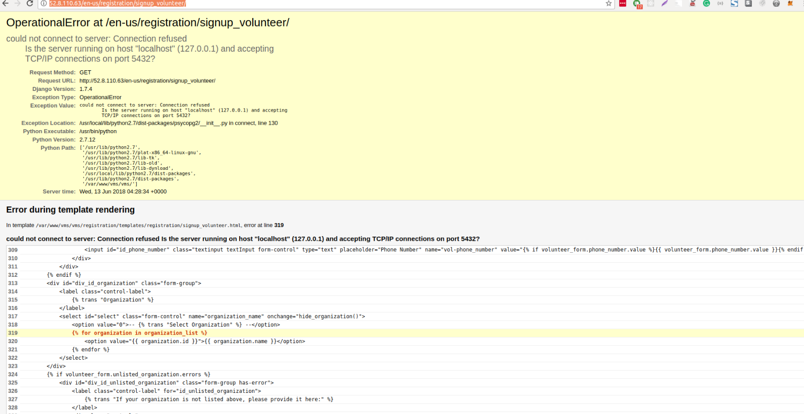

# Preparation for Next step

## Self-Assessment

- Is there anything about the general job search and internship interview process you feel unprepared for? What would make you feel more comfortable and confident in your job search and internship interviews?

- Is there anything about searching for and transitioning into your future career a technical field that you feel unprepared for? What would make you feel more comfortable and confident in this process?

  ### I am unprepared on below topics:

  - *Foundamental knowledges of languages and frameworks in general*
    - *In the last few month, I have learnt and worked with a few frameworks, but not understand them why do them work certain way, I am planning to read their source code more.*
  - *Some interesting projects*
    - *I have been making small toy projects, but personally fell none of them are great enough to represent myself, then I am trying to plan better on next one*  
  - *The ability to search positions accept juniors*
  - *More networking, in order to make more friends in this industry*
  - *It is chanlenge to write great cover letter*

## Plan

- Then, think critically about how you can address the areas identified in your answers. What work can you do to begin knocking down those barriers? Could you study up on a skill? Work on further refining your cover letter? Seek out resources with interview advice? Practice coding concepts by building another app?

- Determine what steps you can take to further develop each area identified in your answers. Add a Plan section to your README. Add description or list outlining how you can work toward improving these areas, and commit.

### I am planning to do these in the comming days

  - *Read more books about python and programming in general*
  - *Make two or more full-stack apps*
  - *Bloging to document my learning*
  - *Working on an open source project syster(vms)*
  - *Search more cover letter templates*
  

## Work

- Add a README section called Work, and begin an ongoing list of tasks/activities you complete today, with their corresponding materials or content. Add to the list and commit periodically throughout the day.

- What do we mean by "corresponding materials or content"? Just the tangible stuff associated with each activity. For instance, if you watched a YouTube tutorial series on interview tips, or an advanced technical concept, link it! If you researched and signed up for an event to help better network, include a screenshot of your ticket. If you built an app to help you practice, include the project in the repository. If you wrote a blog post or further refined your cover letters, include the text files here in your repository. You get the picture!

- [Updated my linkin](https://www.linkedin.com/in/adrianacmy/)
- [Updated git repos](https://github.com/Adrianacmy?tab=repositories)
- [Find the open source project I am going to work on and find a bug on their live demo](https://github.com/systers/vms)

- [Cover letter](https://docs.google.com/document/d/1Gs0GIPU-eh3nldlXUul0J2U_SieXgPWaIJ6t7YZrnJQ/edit?usp=sharing)

## Reflection & Next Steps

- Do you feel like you made improvement today? Are you more confident and comfortable in one or more areas? Why or why not?

- *Yes, what I did help me sort out my mind.*

- Where are you at now? What are your next steps? What do you still need to accomplish to feel confident and prepared to begin your eventual job search?

- *I started my personal and opend source projects.*
- *The next step is keep working on them.*
- *Keep adding features and polishing projects will add more confidence on me*